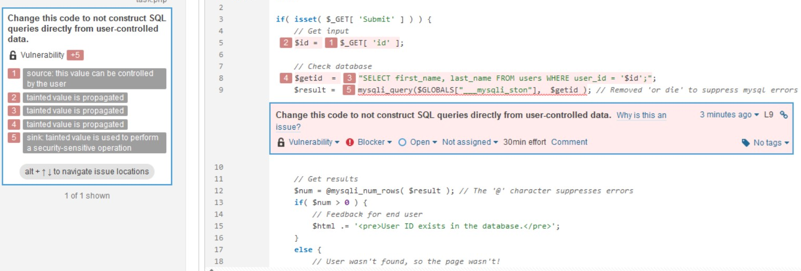
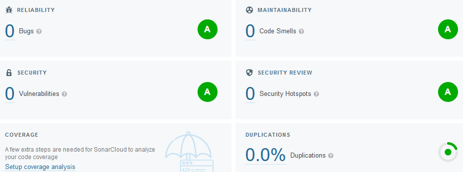

## Отчет о проделанной работе

### 1. Анализ кода задания на сайте Blind Sql Injection на dvwa.local с использованием статического анализатора кода




### 2. Анализ кода

Разберем код по шагам.

```    $id = $_GET[ 'id' ];``` - в переменную id записывается текст, введенный пользователем(параметр 'id' из GET
запроса).

В последствии эта переменная подставляется напрямую в SQL запрос, который в последствии выполняется на сервере.

```	
$getid  = "SELECT first_name, last_name FROM users WHERE user_id = '$id';";
$result = mysqli_query($GLOBALS["___mysqli_ston"],  $getid );
```

Чем это может гразить?

Если пользователь воспользуется данной уязвимостью и введет в поле строку ```qwe' (SQL-command)```, где SQL-command -
любая sql команда, то данная строка подставиться в запрос и без проблем выполнится.

```"SELECT first_name, last_name FROM users WHERE user_id = 'qwe' SQL-command;";```

В sql-command может быть все что угодно, вплодь до ```DROP TABLE```

### 3. Исправление

Воспользуемся несколькими методами предотовращения SQL-инъекии:

1. Параметрический запрос
2. Проверка вводимых пользователем данных

```        
$query = $db->prepare( 'SELECT first_name, last_name FROM users WHERE user_id = (:id) LIMIT 1;' );
$query->bindParam( ':id', mysqli_real_escape_string($GLOBALS["___mysqli_ston"],  $id ) );
$query->execute();
```

```
if (is_numeric($id)) 
```
Входе дальнейшей проверки, обновленный код успешно прошел статический анализ
